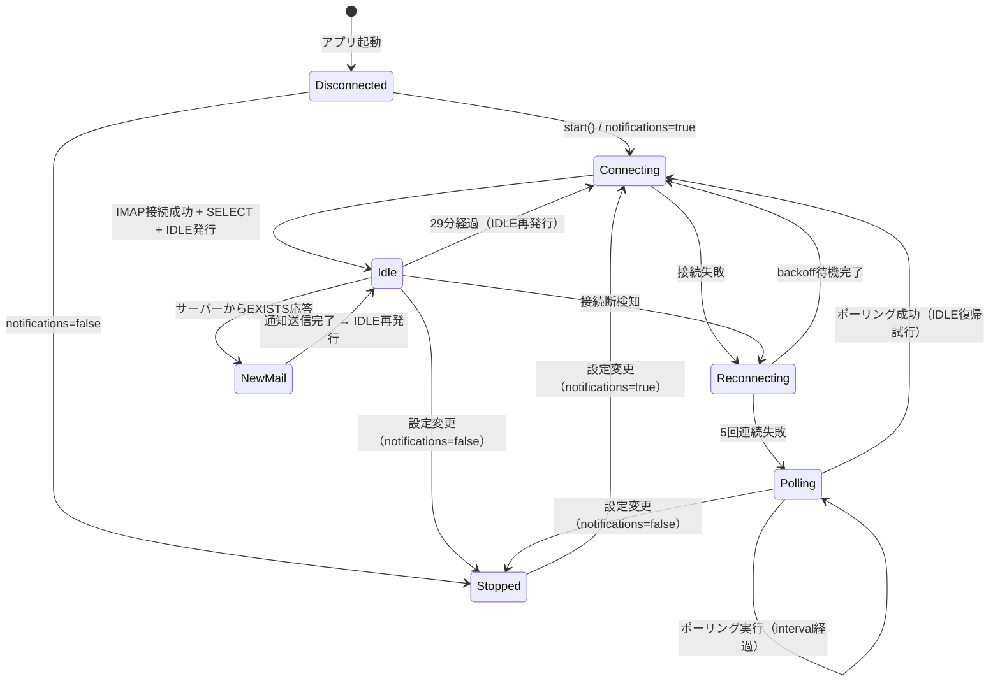

# Business Logic Model — Unit 1: IdleWatcher

## 状態遷移図



## メインループフロー

```
start(accounts, folders)
  └─ for each (account, folder) where notifications=true:
       spawn idle_loop(account, folder)

idle_loop(account, folder):
  loop {
    1. connect_idle(account, folder)  → ImapSession
    2. session.idle().await            → Wait for server response
    3. match response:
       - EXISTS → fetch_new_since(last_uid) → on_new_mail() → continue
       - timeout(29min) → continue (re-issue IDLE)
       - error → break to reconnect
  }
  // If loop breaks:
  reconnect_with_backoff(account, folder)

reconnect_with_backoff(account, folder):
  for attempt in 1..=5:
    sleep(backoff(attempt))  // 5s, 10s, 30s, 60s, 300s
    if connect_idle(account, folder).is_ok():
      return idle_loop(account, folder)  // 復帰
  // 5回失敗:
  log::info!("IDLE→Polling fallback")
  poll_fallback(account, folder)

poll_fallback(account, folder):
  loop {
    sleep(sync_interval)  // デフォルト5分
    mails = fetch_new_since(last_uid)
    if mails.len() > 0: on_new_mail(mails)
    // 定期的にIDLE復帰を試行（10回ポーリングごと）
    if poll_count % 10 == 0:
      if connect_idle(account, folder).is_ok():
        return idle_loop(account, folder)
  }
```

## on_new_mail フロー

```
on_new_mail(app, account_index, mails):
  1. 通知送信（tauri_plugin_notification）
     - title: "SmartAM"
     - body: "{from}: {subject}" or "{from}: {subject} 他N件"
     - silent: !account.notificationSound
  2. イベント発火: app.emit("new-mail", { accountIndex, mails })
  3. Trayバッジ更新: tray::update_badge(app, total_unread)
  4. ログ: log::debug!("new mail: account={} count={}", index, mails.len())
```
