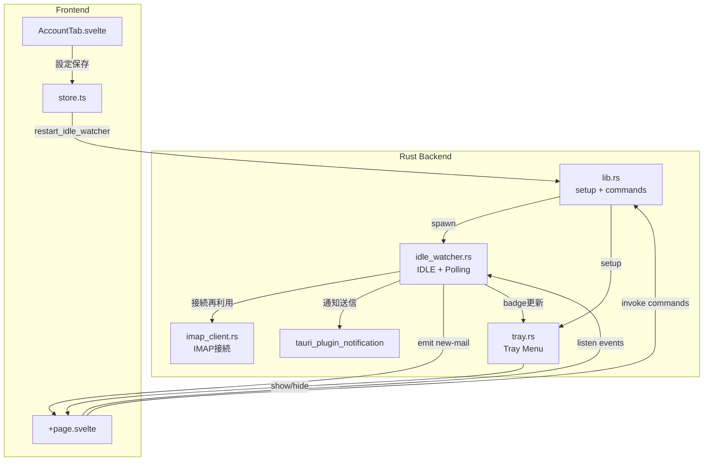

# Component Dependencies — Iteration 4

## 依存関係図



## 依存マトリクス

| コンポーネント | 依存先 | 通信方式 |
|---|---|---|
| IdleWatcher | imap_client.rs | 関数呼び出し（接続確立） |
| IdleWatcher | tauri_plugin_notification | API呼び出し（通知送信） |
| IdleWatcher | AppHandle | `app.emit()` でFEにイベント送信 |
| IdleWatcher | TrayManager | バッジ件数更新 |
| TrayManager | AppHandle | ウィンドウ表示/非表示制御 |
| lib.rs | IdleWatcher | setup時にspawn |
| lib.rs | TrayManager | setup時に初期化 |
| +page.svelte | IdleWatcher | イベントリスナー（`new-mail`） |
| +page.svelte | lib.rs | コマンド呼び出し（`get_idle_status`） |
| AccountTab | store.ts | 設定保存→ `restart_idle_watcher` トリガー |

## データフロー

```
[IMAP Server] → IDLE通知 → [IdleWatcher] → macOS通知 (plugin)
                                          → emit("new-mail") → [+page.svelte] → UI更新
                                          → TrayManager → バッジ更新
```
