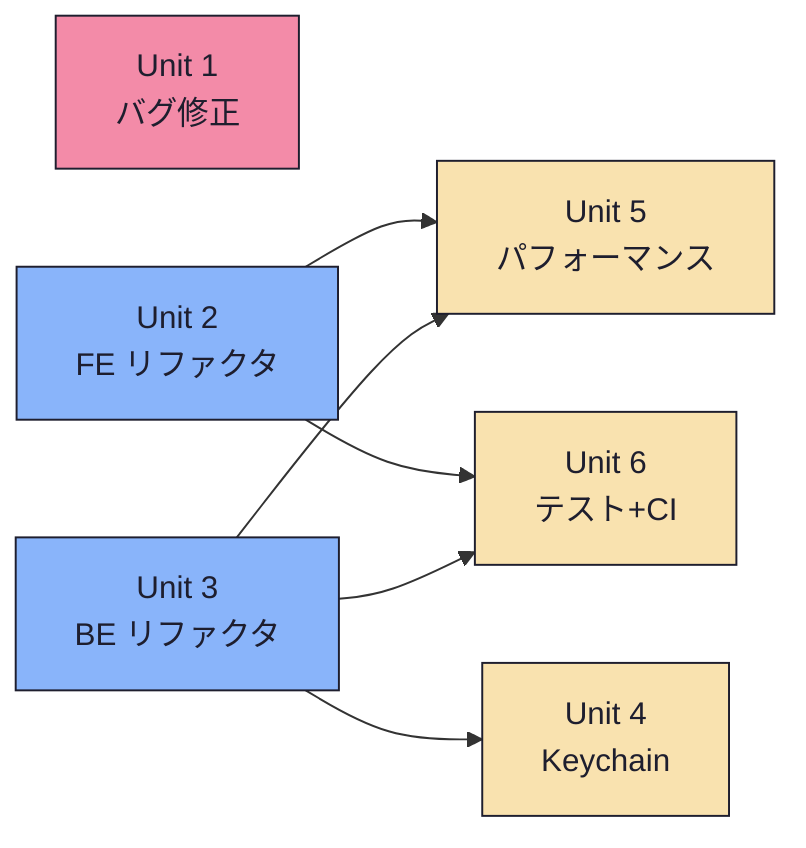

# Unit of Work — Dependency Matrix

## Dependency Diagram



## Execution Order

```
Phase A (先行リリース):  Unit 1 → リリース v0.2.13
Phase B (並行):          Unit 2 + Unit 3 (同時着手可能)
Phase C (依存解決後):    Unit 4 + Unit 5 + Unit 6 (Unit 2,3完了後)
Final Release:           v0.3.0
```

## Dependency Matrix

| Unit | Depends On | Blocks | Can Parallel With |
|------|-----------|--------|-------------------|
| 1 | なし | なし | 2, 3 |
| 2 | なし | 5, 6 | 1, 3 |
| 3 | なし | 4, 5, 6 | 1, 2 |
| 4 | 3 | なし | 5, 6 |
| 5 | 2, 3 | なし | 4, 6 |
| 6 | 2, 3 | なし | 4, 5 |
