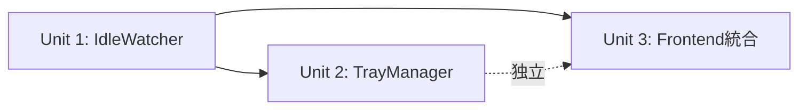

# Unit of Work Dependencies — Iteration 4

## 依存マトリクス

| Unit | 依存先 | 依存種別 |
|---|---|---|
| Unit 1 (IdleWatcher) | imap_client.rs | ビルド時（関数呼び出し） |
| Unit 1 (IdleWatcher) | tauri_plugin_notification | ビルド時（crate依存） |
| Unit 2 (TrayManager) | Unit 1 (IdleWatcher) | ランタイム（バッジ件数取得） |
| Unit 3 (Frontend) | Unit 1 (IdleWatcher) | ランタイム（イベント受信） |
| Unit 3 (Frontend) | Unit 2 (TrayManager) | なし（独立） |

## 実行順序の根拠

- Unit 1 が先: イベント発火元がないとUnit 2, 3のテストができない
- Unit 2 は Unit 1 完了後: バッジ更新にIdleWatcherの件数が必要
- Unit 3 は最後: Unit 1, 2が動作する前提でFE側を接続

## 共有リソース

| リソース | 使用ユニット | 競合リスク |
|---|---|---|
| AppHandle | 全ユニット | なし（Clone可能） |
| IMAP接続プール | Unit 1 + 既存imap_client | 低（IDLE用は別接続） |
| store.json（設定） | Unit 3 → Unit 1 | なし（設定変更→restart で同期） |
