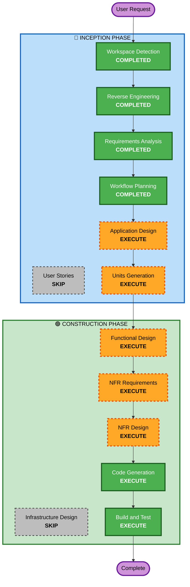

# Execution Plan

## Detailed Analysis Summary

### Transformation Scope
- **Transformation Type**: Architectural refactoring + Quality hardening
- **Primary Changes**: コンポーネント分割、テスト基盤構築、セキュリティ強化、パフォーマンス改善
- **Related Components**: Frontend全体 + Backend全体（横断的改善）

### Change Impact Assessment
- **User-facing changes**: Yes — リンクバグ修正、パフォーマンス改善（仮想スクロール）
- **Structural changes**: Yes — God Component分割、エラーハンドリング再設計
- **Data model changes**: No
- **API changes**: No（Tauriコマンドインターフェースは維持）
- **NFR impact**: Yes — セキュリティ（Keychain）、パフォーマンス（非同期IMAP、仮想スクロール）

### Risk Assessment
- **Risk Level**: Medium（既存動作を壊すリスクあるが、テスト追加で軽減）
- **Rollback Complexity**: Easy（git revertで戻せる）
- **Testing Complexity**: Complex（テスト基盤自体を構築する必要あり）

## Workflow Visualization

## Phases to Execute

### 🔵 INCEPTION PHASE
- [x] Workspace Detection (COMPLETED)
- [x] Reverse Engineering (COMPLETED)
- [x] Requirements Analysis (COMPLETED)
- [x] User Stories — SKIP
  - **Rationale**: 内部リファクタリング・品質改善。ユーザーペルソナ不要
- [x] Workflow Planning (COMPLETED)
- [ ] Application Design — EXECUTE
  - **Rationale**: God Component分割のためコンポーネント設計が必要
- [ ] Units Generation — EXECUTE
  - **Rationale**: 5軸並行開発のためユニット分割が必要

### 🟢 CONSTRUCTION PHASE (per-unit)
- [ ] Functional Design — EXECUTE
  - **Rationale**: エラーハンドリング再設計、コンポーネント分割の詳細設計
- [ ] NFR Requirements — EXECUTE
  - **Rationale**: パフォーマンス・セキュリティ要件の技術選定
- [ ] NFR Design — EXECUTE
  - **Rationale**: Keychain統合、非同期IMAP、仮想スクロールの設計
- [ ] Infrastructure Design — SKIP
  - **Rationale**: デスクトップアプリのためインフラ変更なし
- [ ] Code Generation — EXECUTE (ALWAYS)
  - **Rationale**: 実装計画策定 + コード生成
- [ ] Build and Test — EXECUTE (ALWAYS)
  - **Rationale**: テスト基盤構築 + CI/CD設定

## Units (並行開発ユニット案)

| Unit | 内容 | 依存関係 |
|------|------|---------|
| Unit 1 | バグ修正（HTMLリンク） | なし |
| Unit 2 | Frontend リファクタリング（God Component分割） | なし |
| Unit 3 | Backend リファクタリング（エラーハンドリング + Dead Code除去） | なし |
| Unit 4 | セキュリティ（Keychain移行） | Unit 3 |
| Unit 5 | パフォーマンス（仮想スクロール + 非同期IMAP） | Unit 2, 3 |
| Unit 6 | テスト基盤 + CI/CD | Unit 2, 3 |

## Success Criteria
- **Primary Goal**: 既存SmartAMの品質を本番レベルに引き上げ
- **Key Deliverables**:
  - HTMLリンクバグ修正
  - コンポーネント分割完了（各10KB以下）
  - テストカバレッジ80%+
  - CI/CD稼働
  - APIキーKeychain保存
  - 仮想スクロール + 非同期IMAP
- **Quality Gates**:
  - `cargo clippy` 警告ゼロ
  - `svelte-check` エラーゼロ
  - 全テストパス
  - Security Extension全ルール準拠
