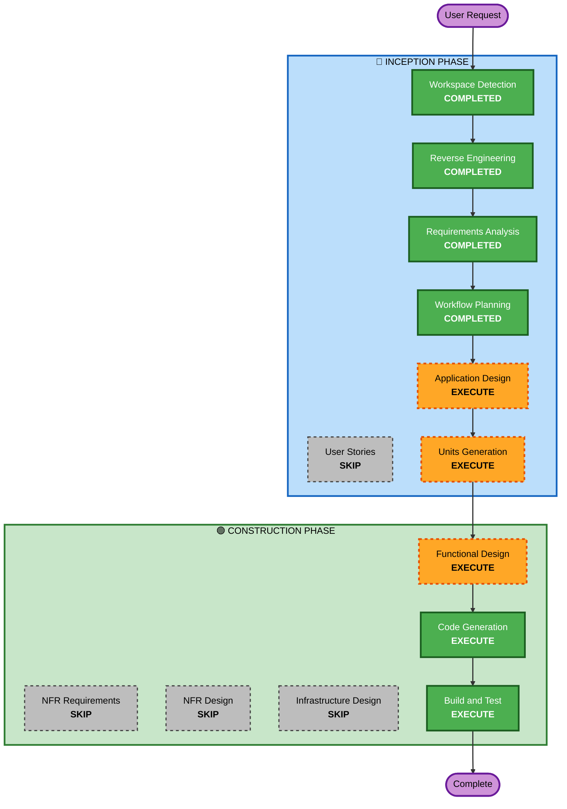

# Execution Plan — Iteration 4: 新規メール受信通知

## Detailed Analysis Summary

### Transformation Scope
- **Transformation Type**: Architectural（ポーリングをFE→Rustバックグラウンドに移動 + IMAP IDLE追加 + Tray常駐化）
- **Primary Changes**: 新規Rustモジュール追加、既存ポーリングロジック置換、Tauriプラグイン追加
- **Related Components**: imap_client.rs, lib.rs, +page.svelte, store.ts, AccountTab.svelte

### Change Impact Assessment
- **User-facing changes**: Yes — メニューバーアイコン追加、Dockアイコン非表示、通知対象フォルダ設定UI
- **Structural changes**: Yes — バックグラウンドサービス層の新設
- **Data model changes**: Yes — アカウント設定に `notificationFolders` フィールド追加
- **API changes**: No — 外部APIは変更なし（内部Tauriコマンド追加のみ）
- **NFR impact**: Yes — 常時接続によるリソース消費、信頼性要件

### Risk Assessment
- **Risk Level**: Medium
- **Rollback Complexity**: Moderate（既存ポーリングを残しておけばフォールバック可能）
- **Testing Complexity**: Moderate（IDLE接続のモック、ネットワーク断シミュレーション）

## Workflow Visualization

## Phases to Execute

### 🔵 INCEPTION PHASE
- [x] Workspace Detection (COMPLETED)
- [x] Reverse Engineering (COMPLETED)
- [x] Requirements Analysis (COMPLETED)
- [x] User Stories — SKIP（内部機能改善、ユーザーペルソナ不要）
- [x] Workflow Planning (COMPLETED)
- [ ] Application Design — EXECUTE
  - **Rationale**: 新規バックグラウンドサービス層の設計が必要。既存コンポーネントとの責務分離を明確化
- [ ] Units Generation — EXECUTE
  - **Rationale**: 3つ以上の独立した改修領域（IDLE, Tray, 設定UI）があり分割が有効

### 🟢 CONSTRUCTION PHASE
- [ ] Functional Design — EXECUTE
  - **Rationale**: IDLE状態遷移、再接続ロジック、フォールバック切替の詳細設計が必要
- [ ] NFR Requirements — SKIP
  - **Rationale**: 要件定義でNFR確定済み（NFR-1〜4）。追加分析不要
- [ ] NFR Design — SKIP
  - **Rationale**: NFRパターンは要件内で十分定義済み
- [ ] Infrastructure Design — SKIP
  - **Rationale**: ローカルデスクトップアプリ。インフラ設計不要
- [ ] Code Generation — EXECUTE (ALWAYS)
- [ ] Build and Test — EXECUTE (ALWAYS)

## Estimated Timeline
- **Total Stages to Execute**: 5（AD + UG + FD + CG + BT）
- **Estimated Duration**: 実装3-5日

## Success Criteria
- IMAP IDLE接続が維持され、新着メールを即座に検知する
- ウィンドウ閉じてもメニューバーアイコンから再表示可能
- ネットワーク断時にポーリングフォールバックが動作する
- 既存の通知ON/OFF設定が正しく反映される
- `cargo check` + `npm run check` がエラーなし
