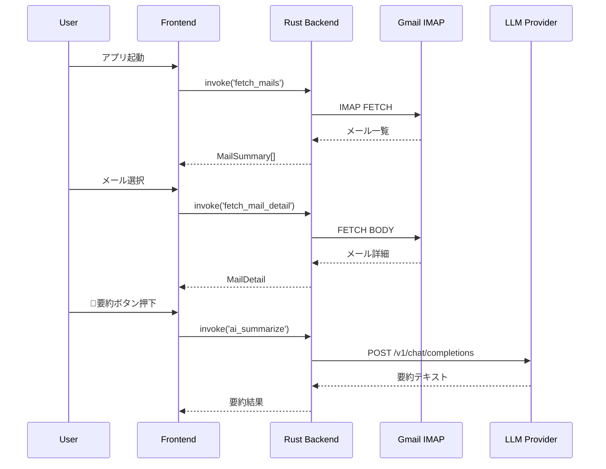

# System Architecture

## System Overview

SmartAMはTauri v2ベースのデスクトップアプリケーション。Rustバックエンドがメール通信・AI API・カレンダー連携を担当し、SvelteKitフロントエンドがUIを提供する。SPAアーキテクチャで、全画面遷移はフロントエンド内で完結。

## Architecture Diagram

```mermaid
graph TB
    subgraph Frontend["Frontend (SvelteKit/Svelte 5)"]
        Page["+page.svelte (SPA Root)"]
        Sidebar[Sidebar.svelte]
        MailList[MailList.svelte]
        MailDetail[MailDetail.svelte]
        AiPanel[AiPanel.svelte]
        CalPanel[CalendarPanel.svelte]
        Settings[Settings.svelte]
        Compose[ComposeModal.svelte]
        Store[store.ts]
    end

    subgraph Backend["Backend (Rust/Tauri v2)"]
        Lib[lib.rs - Commands]
        IMAP[imap_client.rs]
        SMTP[smtp_client.rs]
        AI[ai_client.rs]
        AIUsage[ai_usage.rs]
        OAuth[oauth.rs]
        Cal[calendar.rs]
        ICS[ics_parser.rs]
    end

    subgraph External["External Services"]
        Gmail[Gmail IMAP/SMTP]
        LLMs[LLM Providers]
        AppleCal[Apple Calendar]
        GoogleCal[Google Calendar]
    end

    Page --> Sidebar & MailList & MailDetail & Settings & Compose
    MailDetail --> AiPanel & CalPanel
    Store -->|Tauri Store Plugin| Backend
    Page -->|invoke()| Lib
    Lib --> IMAP & SMTP & AI & OAuth & Cal
    IMAP --> Gmail
    SMTP --> Gmail
    AI --> LLMs
    OAuth --> Gmail
    Cal --> AppleCal & GoogleCal
    AI --> AIUsage
    Cal --> ICS
```

## Component Descriptions

### lib.rs (Tauri Command Hub)
- **Purpose**: フロントエンドからのinvoke呼び出しを受け付けるコマンド定義
- **Responsibilities**: 全Tauriコマンドのエントリポイント、型定義（MailSummary, MailDetail, AccountConfig等）
- **Dependencies**: 全バックエンドモジュール
- **Type**: Application

### imap_client.rs
- **Purpose**: IMAP通信（メール取得・フォルダ操作・検索）
- **Responsibilities**: 接続管理、メール一覧取得、詳細取得、フォルダ一覧、アーカイブ・削除・スター操作
- **Dependencies**: imap, native-tls, mailparse
- **Type**: Application

### ai_client.rs
- **Purpose**: LLM API統合
- **Responsibilities**: OpenAI互換API呼び出し、Bedrock Converse API呼び出し、要約・下書き・翻訳・カレンダー検出
- **Dependencies**: reqwest, serde_json
- **Type**: Application

### ai_usage.rs
- **Purpose**: AIトークン使用量追跡・コスト計算
- **Responsibilities**: 使用量記録、月次集計、予算上限チェック
- **Dependencies**: chrono, dirs
- **Type**: Application

### calendar.rs
- **Purpose**: カレンダーイベント登録
- **Responsibilities**: Apple Calendar (AppleScript)、Google Calendar (REST API) へのイベント登録
- **Dependencies**: chrono, reqwest
- **Type**: Application

### oauth.rs
- **Purpose**: Google OAuth 2.0認証
- **Responsibilities**: 認証フロー（loopback redirect）、トークンリフレッシュ
- **Dependencies**: reqwest, open
- **Type**: Application

## Data Flow



## Integration Points

- **External APIs**: Gmail (IMAP/SMTP), LLM Providers (OpenAI/Anthropic/Bedrock/Gemini/Ollama), Google Calendar REST API
- **Databases**: なし（設定はTauri Store Plugin → settings.json、AI使用量はローカルJSONファイル）
- **Third-party Services**: Google OAuth 2.0, Apple Calendar (AppleScript経由)

## Infrastructure Components

- **CDK Stacks**: なし（デスクトップアプリ）
- **Deployment Model**: DMGインストーラー配布 + Tauri Updater Plugin による自動更新
- **Networking**: ローカルアプリからの外部API呼び出しのみ
