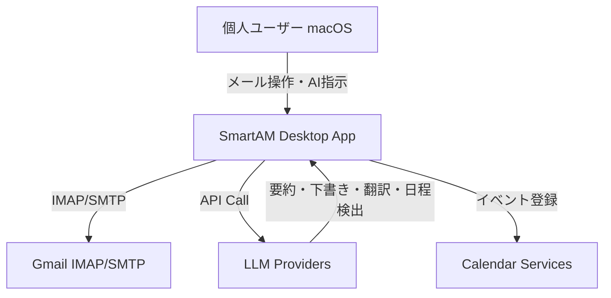

# Business Overview

## Business Context Diagram

## Business Description

- **Business Description**: AIをネイティブに統合したデスクトップメールクライアント。メール処理をAIで効率化し、要約・返信生成・翻訳・カレンダー登録をワンクリックで実行する。
- **Business Transactions**:
  1. **メール閲覧** — IMAP経由でメール取得・一覧表示・詳細表示
  2. **メール送信** — 新規作成・返信・転送をSMTP経由で送信
  3. **AI要約** — メール本文をLLMに送信し5行以内の要約を生成
  4. **AI返信下書き** — 2ステップ（ニュアンス提案→返信文生成）で返信案を作成
  5. **AI翻訳** — メール本文を指定言語に翻訳（HTMLレイアウト維持）
  6. **カレンダー登録** — メールから日程を検出し、Apple/Google Calendarに登録
  7. **アカウント管理** — 複数Gmailアカウントの追加・切替・OAuth認証
- **Business Dictionary**:
  - **オンデマンドAI**: ボタン押下時のみLLM APIを呼び出す設計方針（トークン節約）
  - **ニュアンス**: AI返信下書きの第1ステップで提案される返答の方向性（承諾・拒否・保留等）
  - **Brownfield**: 既存コードが存在するプロジェクト

## Component Level Business Descriptions

### Frontend (SvelteKit + Svelte 5)
- **Purpose**: ユーザーインターフェースの提供
- **Responsibilities**: メール一覧/詳細表示、AI機能パネル、設定画面、キーボードショートカット

### Backend (Rust / Tauri v2)
- **Purpose**: メール通信・AI API呼び出し・カレンダー連携のコアロジック
- **Responsibilities**: IMAP/SMTP通信、LLM API統合、OAuth認証、カレンダーイベント登録、トークン使用量追跡
