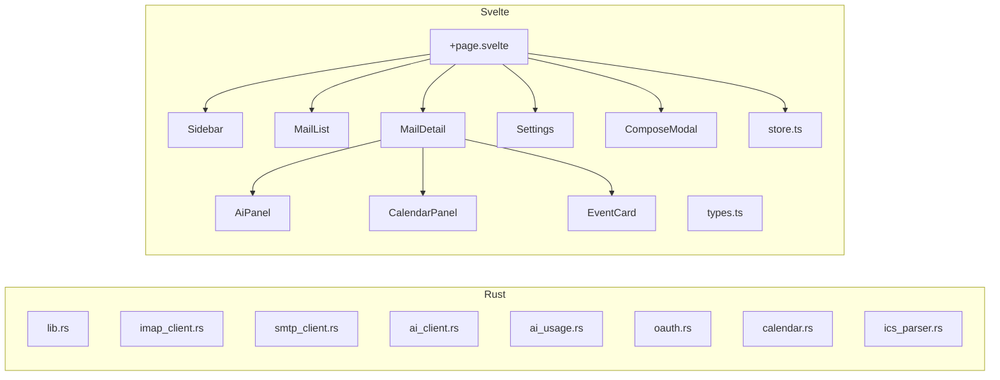

# Code Structure

## Build System
- **Type**: npm (SvelteKit) + Cargo (Rust/Tauri v2)
- **Configuration**: `app/package.json`, `app/src-tauri/Cargo.toml`, `app/src-tauri/tauri.conf.json`

## Key Classes/Modules

### Existing Files Inventory

**Rust Backend (app/src-tauri/src/)**:
- `main.rs` — Tauriアプリエントリポイント
- `lib.rs` (20KB) — 全Tauriコマンド定義・型定義・トークンリフレッシュ
- `imap_client.rs` (32KB) — IMAP操作全般（最大ファイル）
- `ai_client.rs` (11KB) — LLM API呼び出し（OpenAI互換 + Bedrock Converse）
- `ai_usage.rs` (11KB) — トークン使用量追跡・コスト計算
- `smtp_client.rs` (5KB) — SMTP送信
- `oauth.rs` (7KB) — Google OAuth 2.0フロー
- `calendar.rs` (5KB) — カレンダーイベント登録
- `ics_parser.rs` (3KB) — ICSファイルパース

**Frontend (app/src/)**:
- `routes/+page.svelte` (32KB) — SPAルート（状態管理・ショートカット・全体制御）
- `lib/store.ts` (7KB) — 設定永続化・ヘルパー関数
- `lib/types.ts` (1KB) — TypeScript型定義
- `lib/components/Settings.svelte` (35KB) — 設定画面（最大コンポーネント）
- `lib/components/MailDetail.svelte` (19KB) — メール詳細・AI機能統合
- `lib/components/MailList.svelte` (6KB) — メール一覧
- `lib/components/AiPanel.svelte` (7KB) — AI機能パネル（要約・下書き・翻訳）
- `lib/components/CalendarPanel.svelte` (5KB) — カレンダー登録パネル
- `lib/components/EventCard.svelte` (5KB) — カレンダーイベントカード
- `lib/components/Sidebar.svelte` (5KB) — サイドバー
- `lib/components/ComposeModal.svelte` (5KB) — メール作成モーダル

## Design Patterns

### Command Pattern (Tauri invoke)
- **Location**: Frontend → Backend通信全般
- **Purpose**: フロントエンドからRustバックエンドの関数を呼び出す
- **Implementation**: `invoke('command_name', { params })` → Rust `#[tauri::command]`

### Reactive State (Svelte 5 Runes)
- **Location**: 全Svelteコンポーネント
- **Purpose**: UIの反応的更新
- **Implementation**: `$state()`, `$derived()`, `$effect()` runes

### Settings Store (Tauri Store Plugin)
- **Location**: `store.ts` + `settings.json`
- **Purpose**: アプリ設定の永続化
- **Implementation**: `@tauri-apps/plugin-store` でJSON永続化

## Critical Dependencies

### Rust
- `tauri` 2.10.3 — デスクトップアプリフレームワーク
- `imap` 2 — IMAP通信（同期版）
- `lettre` 0.11 — SMTP送信
- `reqwest` 0.12 — HTTP クライアント（AI API・OAuth）
- `mailparse` 0.15 — メールパース
- `tokio` 1 — 非同期ランタイム
- `chrono` 0.4 — 日時処理

### Frontend
- `svelte` 5.55 — UIフレームワーク
- `@sveltejs/kit` 2.57 — アプリフレームワーク
- `@tauri-apps/api` 2.10 — Tauri API
- `typescript` 6.0 — 型システム
- `vite` 8.0 — ビルドツール
