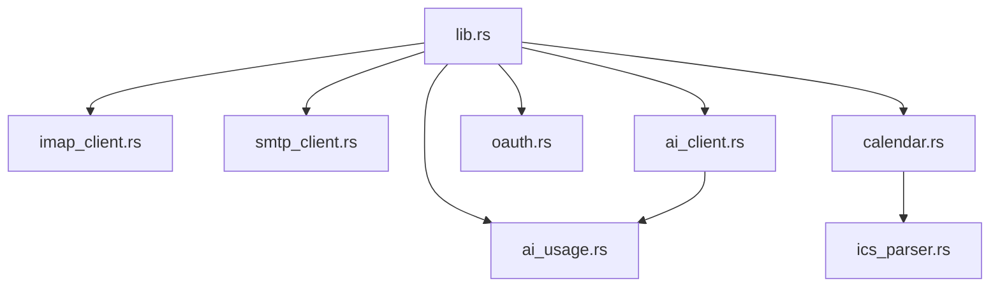

# Dependencies

## Internal Dependencies

### lib.rs depends on all modules
- **Type**: Compile
- **Reason**: Tauriコマンドハブとして全モジュールの関数を公開

### ai_client depends on ai_usage
- **Type**: Runtime
- **Reason**: API呼び出し後にトークン使用量を記録

### calendar depends on ics_parser
- **Type**: Compile
- **Reason**: ICS添付ファイルからイベント情報を抽出

## External Dependencies (Rust)

### tauri 2.10.3
- **Purpose**: デスクトップアプリフレームワーク
- **License**: MIT/Apache-2.0

### imap 2
- **Purpose**: IMAP通信（同期版）
- **License**: MIT/Apache-2.0

### lettre 0.11
- **Purpose**: SMTP送信
- **License**: MIT

### reqwest 0.12
- **Purpose**: HTTP クライアント（AI API・OAuth・Google Calendar）
- **License**: MIT/Apache-2.0

### mailparse 0.15
- **Purpose**: メールパース（MIME解析・添付ファイル抽出）
- **License**: MIT

### tokio 1
- **Purpose**: 非同期ランタイム
- **License**: MIT

## External Dependencies (Frontend)

### svelte 5.55
- **Purpose**: UIフレームワーク（runes構文）
- **License**: MIT

### @tauri-apps/api 2.10
- **Purpose**: Tauri IPC通信
- **License**: MIT/Apache-2.0
